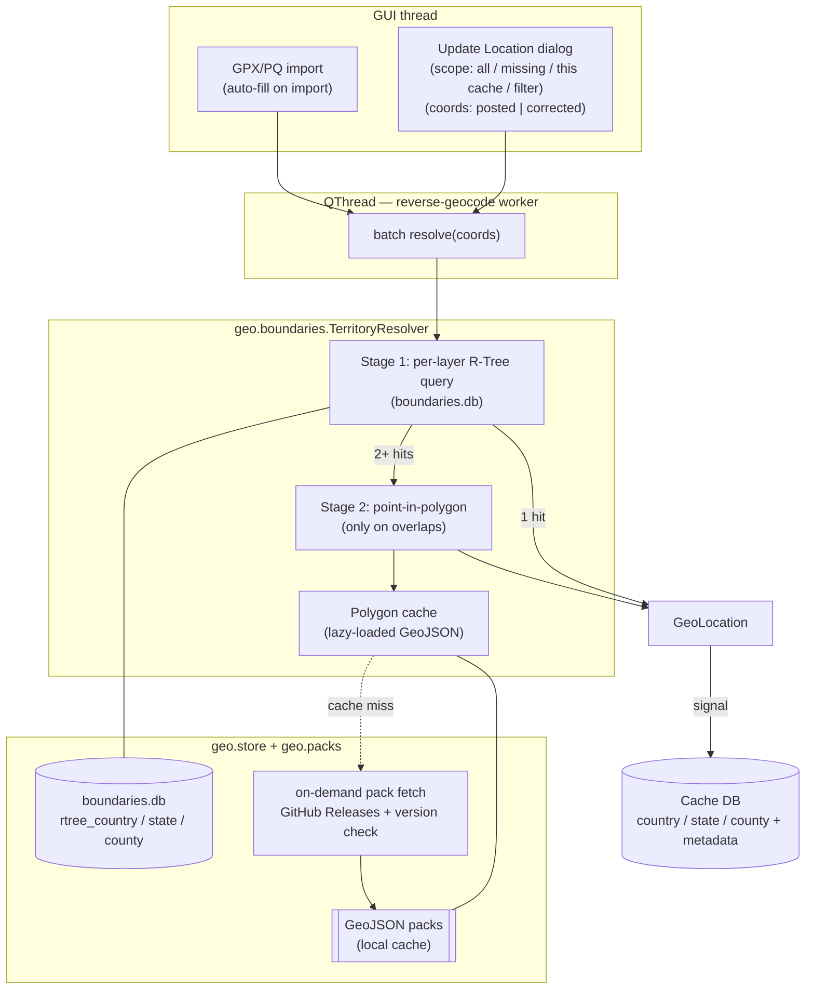
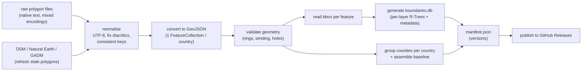
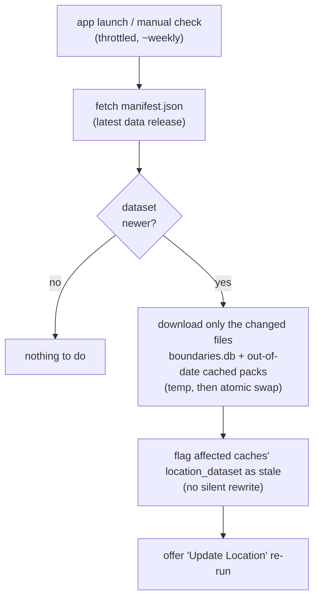

# Architecture — Offline Reverse Geocoding

OpenSAK assigns a **country**, **state/region** and **county** to every cache by reverse geocoding its coordinates against a polygon-accurate boundary dataset held on the user's machine. The dataset is **local-first**: a baseline ships with the app, the rest is fetched once from GitHub and cached on disk, after which lookups need no network and have no rate limits. A full database resolves on a background thread in seconds.

This document describes the design of that subsystem — the *boundary engine*.

> **Acknowledgements.** The two-stage spatial design and the boundary dataset described here build directly on GSAK. Mike (*Lignumaqua*), GSAK's custodian, generously shared the approach, the bounding-box index and the public polygon files, and offered them to OpenSAK. This architecture adapts that work to a modern, open stack — the credit for the original method and data is his and the wider GSAK community's.

---

## Contents

- [1. Problem](#1-problem)
- [2. Concept](#2-concept)
- [3. Benefits](#3-benefits)
- [4. Design decisions](#4-design-decisions)
  - [Improvements over the GSAK lineage](#improvements-over-the-gsak-lineage)
- [5. Boundary data model](#5-boundary-data-model)
  - [5.1 Polygon files](#51-polygon-files)
  - [5.2 The bounding-box database](#52-the-bounding-box-database)
  - [5.3 On-disk layout and caching](#53-on-disk-layout-and-caching)
- [6. System overview](#6-system-overview)
  - [6.1 The two-stage query](#61-the-two-stage-query)
  - [6.2 Build-time data pipeline](#62-build-time-data-pipeline)
  - [6.3 Distribution](#63-distribution)
- [7. Keeping the data up to date](#7-keeping-the-data-up-to-date)
- [8. Storage and bandwidth estimates](#8-storage-and-bandwidth-estimates)
- [9. Database schema](#9-database-schema)
- [10. Dependencies](#10-dependencies)
- [11. Module layout and integration](#11-module-layout-and-integration)
- [12. Performance](#12-performance)
- [13. Accuracy and edge cases](#13-accuracy-and-edge-cases)
- [14. Roadmap](#14-roadmap)
- [15. Risks](#15-risks)
- [Appendix A — Glossary](#appendix-a--glossary)

---

## 1. Problem

Geocachers need reliable **country / state (region) / county** values on every cache, for three concrete reasons:

1. **County / region challenges.** Many caches qualify a finder for a "find a cache in every county"-style challenge. Going to the wrong county is expensive — literally, long drives — and frustrating.
2. **Filtering and trip planning.** "Show me caches in this county" only works when the field is populated and correct.
3. **Parity with other tools.** Users cross-check OpenSAK against GSAK, Project-GC and Cachetur. When the answer disagrees, OpenSAK gets the support ticket.

The data is **not** reliably available from the source files:

- Imported GPX / Pocket Query files generally fill `country` and sometimes `state`, but **county is almost always empty**.
- A cache's real-world location can differ from its *posted* coordinates — multi-caches and mystery/puzzle finals can sit tens of miles away. The territory may need computing from **corrected** coordinates.
- Boundaries change over time (county splits, `Turkey → Türkiye`, `Czech Republic → Czechia`). Static values go stale.

Reverse geocoding is fundamentally a **point-in-region** query: given a point, find which administrative polygons contain it. The challenge is doing that **accurately** (correct at and near borders) and **fast** (tens of thousands of caches at once), without depending on a live network service per lookup.

---

## 2. Concept

The naive solution — test the point against every polygon — is `O(regions × vertices)` per cache and does not scale.

The boundary engine uses a **two-stage lookup** built on a spatial index (see [SQLite R-Tree](https://sqlite.org/rtree.html)):

1. **Stage 1 — bounding-box filter (R-Tree).** Every region is reduced to its min/max latitude and longitude — an axis-aligned bounding box. These boxes live in a SQLite **R-Tree** index. Querying it with a point returns only the handful of regions whose box *contains* the point. This is `O(log n)` and extremely fast.
2. **Stage 2 — point-in-polygon (exact).** In the common case the point lands in exactly one box → done, with no geometry maths. Only when boxes **overlap** (very common for counties, and near any border) does the engine run the precise point-in-polygon test, and only on the 2–3 candidates Stage 1 returned.

This keeps the expensive geometry off the hot path. Because a county record names its parent state and country, a single county hit fills all three fields at once.

The two-stage structure follows the design GSAK has used for years (its bounding-box index plus polygon-file system); OpenSAK re-expresses it in clean, modern data — see [Improvements over the GSAK lineage](#improvements-over-the-gsak-lineage).

---

## 3. Benefits

- **Local-first and fast.** Once the relevant boundary data is cached on the machine, a 10k+ cache database resolves locally in seconds — no per-lookup network call, no rate limits, works in the field.
- **Polygon-accurate.** Results are correct at and near borders, not snapped to the nearest town. This is what challenge caching requires.
- **Auditable provenance.** Every value records where it came from (imported vs computed), which coordinates produced it (posted vs corrected), when, and against which boundary dataset version.
- **Both coordinate bases.** Posted coordinates by default (checker compatibility); corrected coordinates on demand for physical planning.
- **Controlled footprint.** A small baseline ships with the app; detailed county data is fetched and cached only when a region actually needs it.
- **Standard format.** Boundaries are stored as **GeoJSON**, so they validate in any GIS tool and can be drawn directly by the Leaflet map for a future "show this boundary" overlay.
- **Live-updatable data.** Boundaries refresh independently of app releases via per-file version numbers (see [§7](#7-keeping-the-data-up-to-date)).
- **No project-run server.** The app install plus GitHub Releases cover everything; there is no backend to host, pay for, or keep alive.
- **Extensible.** The same engine serves any boundary *layer* — custom polygons (Delorme, Ordnance Survey, challenge regions) need only data, not code.

---

## 4. Design decisions

| # | Decision | Choice | Rationale |
|---|----------|--------|-----------|
| D1 | **Boundary data source & format** | Community polygon files of GSAK lineage, **normalised to UTF-8 and converted to GeoJSON** (one `FeatureCollection` per country); OpenSAK regenerates its own R-Tree index from them. The native text is the *ingest* format only. | Community parity for support; crowd-sourced coverage; fixes mixed encodings/diacritics (`Türkiye`, broken `©`); GeoJSON gives unambiguous holes/multipolygons, validation, and direct reuse by the Leaflet map. |
| D2 | **Result storage** | `Cache.country/state/county` hold the single result set; **provenance metadata** (source, coordinate basis, timestamp, dataset version) sits alongside. | Re-runnable and auditable without doubling every column. |
| D3 | **Distribution (no own server)** | Ship a small **baseline** (country + state) in the install; fetch **county packs per country, on demand, from GitHub Releases** and cache them locally. An optional "download all" pre-fetches everything for full offline use. | Controls install/DB footprint; GitHub Releases is free, CDN-backed and durable, so no backend is needed. |
| D4 | **Granularity** | A **layered** engine — country/state/county today, extensible to custom layers — each layer being its own R-Tree + metadata table. | One query path for every layer; adding a custom layer is data, not code. |

Recorded alternatives:

- *Wholesale build from Natural Earth / GADM / OSM only* — clean data, but county coverage is hard and results diverge from established tools, generating support load. These sources are used to **refresh** individual polygons under D1, not as the wholesale base.
- *Keep the native text format end-to-end* — smaller and zero-conversion, but leaves holes/multipolygons as an implicit convention and gives the map nothing to draw. The pipeline already normalises encoding, so converting to GeoJSON at the same time is nearly free.
- *Bundle every polygon in the install* — works fully offline from day one, but the global county set is plausibly a few hundred MB and ~99% of it goes unused by any given user; rejected for D3 (the "download all" option covers people who genuinely want everything).
- *Separate `corrected_*` columns* — instead, D2's `location_basis` records which coordinates produced the stored value.

### Improvements over the GSAK lineage

The data and two-stage method come from GSAK; these are the deliberate changes:

- **UTF-8 everywhere** instead of ANSI — fixes `Türkiye`, `Czechia` and the broken `©` seen in the source files.
- **GeoJSON** instead of the bespoke text format — standard, validatable, unambiguous geometry, and drawable by the existing Leaflet map.
- **Independently updatable data** via versioned packs — GSAK's own maintainer noted its index can only be refreshed by shipping a new GSAK release. OpenSAK refreshes both the index and the polygons from GitHub (see [§7](#7-keeping-the-data-up-to-date)).
- **Clean schema** — drops the legacy `_old` tables and the mixed full-name / 3-letter-code conventions found in the original index.
- **Per-cache provenance** (source, coordinate basis, timestamp, dataset version) — GSAK tracked none of this, so it could never explain *which* coordinates a stored value came from.
- **64-bit runtime** — none of the 32-bit constraints that slow legacy GSAK.

What is intentionally kept: the **two-stage R-Tree + point-in-polygon** method, **one R-Tree per layer**, and **polygon data stored separately** from the index (so it can be fetched lazily).

---

## 5. Boundary data model

Two artefacts, mirroring the GSAK lineage in cleaned, standard form.

### 5.1 Polygon files

**Ingest (build time).** Upstream files arrive in the native GSAK text format: a header of `#` comment lines carrying the display name, the **source and licence**, and a **precomputed bounding box**, followed by one `lat,lon` pair per line. A file may hold several polygons (islands); each polygon's first and last coordinate match (closed ring), and holes are wound in the opposite direction.

```text
# GsakName=Denmark
# This Country polygon is based on data © OpenStreetMap contributors
# The OpenStreetMap data is made available under the Open Database License (ODbL)
# Bounding Box: 57.9524297,54.4516667,12.9058301,7.7153255
54.8370717,9.4829269
54.8316638,9.4629539
...
```

**Stored & distributed.** The pipeline normalises these to UTF-8 and converts them to **GeoJSON**, grouped **one `FeatureCollection` per country**. This is the format OpenSAK ships, caches and reads.

```jsonc
// counties/prt.geojson — one FeatureCollection per country
{
  "type": "FeatureCollection",
  "features": [
    {
      "type": "Feature",
      "properties": {
        "layer": "county",
        "name": "Lisboa",
        "parent": "PT",
        "version": 7,
        "source": "osm",
        "licence": "ODbL"
      },
      "bbox": [-9.5, 38.6, -9.0, 38.9],   // standard GeoJSON bbox member
      "geometry": { "type": "MultiPolygon", "coordinates": [ /* ... */ ] }
    }
    // ... every county/parish in Portugal
  ]
}
```

Key points the format captures:

- The **licence travels with the data.** OSM-derived polygons are **ODbL** (attribution + share-alike), *not* public domain; the property is preserved and surfaced as aggregate attribution (see [§15](#15-risks)).
- The bounding box is **already known** from the source header, so building the index ([§5.2](#52-the-bounding-box-database)) is a read, not a geometry pass.
- Counties are **grouped per country** (Portugal ~3,900 features, Brazil ~5,500), which makes "per-country" the natural download unit ([§5.3](#53-on-disk-layout-and-caching)).

### 5.2 The bounding-box database

A SQLite file — `boundaries.db` (OpenSAK's name for what GSAK ships as `bb.db3`) — generated **once** from the GeoJSON `bbox` members. It is the spatial index plus metadata, and contains **no information not derivable from the polygons**, so it inherits their terms.

GSAK's index uses **one R-Tree per layer** with a companion metadata table, joined by id. OpenSAK keeps that proven shape, cleaned and consistently named:

```sql
-- Stage 1: one R-Tree per layer (SQLite built-in module)
CREATE VIRTUAL TABLE rtree_country USING rtree(id, min_lat, max_lat, min_lon, max_lon);
CREATE VIRTUAL TABLE rtree_state   USING rtree(id, min_lat, max_lat, min_lon, max_lon);
CREATE VIRTUAL TABLE rtree_county  USING rtree(id, min_lat, max_lat, min_lon, max_lon);

-- Stage 2 / metadata: one row per region, id == matching R-Tree id
CREATE TABLE region_county (
    id            INTEGER PRIMARY KEY,
    name          TEXT NOT NULL,   -- UTF-8, normalised ('Türkiye')
    parent        TEXT,            -- 'PT', 'US/TX' — links county -> state -> country
    pack          TEXT NOT NULL,   -- GeoJSON FeatureCollection holding this region
    feature_index INTEGER NOT NULL,-- which feature within the pack
    poly_version  INTEGER NOT NULL,
    is_bundled    INTEGER NOT NULL -- 1 = baseline install, 0 = on-demand pack
);
-- region_country / region_state follow the same shape.

-- Per-file versions, driving update checks (mirrors GSAK's Version table)
CREATE TABLE file_version (layer TEXT, country TEXT, state TEXT, version INTEGER);
```

A US-county name/abbreviation reference table is carried alongside (GSAK ships one) to normalise names — e.g. stripping the spurious word "County" some sources append.

> **Why SQLite's own R-Tree** rather than an external index package: it is a compile-time-standard SQLite module (no extra native dependency to ship on Windows/macOS/Linux), it persists to disk for free, and it keeps the index next to the metadata. Point-in-polygon (Stage 2) is the only piece needing a geometry library — see [§10](#10-dependencies).

For scale: a real index holds ~384 countries, ~2,330 state polygons and ~26,170 county polygons in roughly 7 MB — bounding boxes only. The polygon geometry is far larger and is why counties are fetched on demand ([§8](#8-storage-and-bandwidth-estimates)).

### 5.3 On-disk layout and caching

Under the platform app-data directory (resolved by `config.get_app_data_dir()`):

```
<app-data>/opensak/
├── Default.db                 # the cache database
└── boundaries/
    ├── boundaries.db          # generated R-Trees + metadata (seeded from the install)
    ├── manifest.json          # dataset version + per-pack versions
    ├── countries/             # baseline — bundled with the install
    │   └── world.geojson
    ├── states/                # baseline — bundled with the install
    │   └── *.geojson
    └── counties/              # fetched per country on demand, then cached
        ├── prt.geojson
        └── usa-tx.geojson
```

The `counties/` directory **is the cache**: a country's pack is downloaded once from GitHub Releases, written here, and every later lookup reads it locally. Nothing is re-fetched unless a version bump says the data changed ([§7](#7-keeping-the-data-up-to-date)).

---

## 6. System overview



### 6.1 The two-stage query

```
            point (lat, lon)
                  │
                  ▼
   ┌──────────────────────────────┐
   │ Stage 1  R-Tree bbox SELECT   │   ~O(log n), microseconds
   │ WHERE min_lat<=? AND max_lat  │
   │   >=? AND min_lon<=? ...       │
   └──────────────┬────────────────┘
                  │ candidate region ids
        ┌─────────┴──────────┐
        │                    │
   exactly 1 hit        2+ hits (overlap / border)
        │                    │
        ▼                    ▼
     DONE          ┌────────────────────────┐
   (no geometry)   │ Stage 2  point-in-poly  │  only on 2–3 candidates
                   │ load GeoJSON, ray-cast  │
                   │ (holes respected)       │
                   └───────────┬─────────────┘
                               ▼
                        winning region
```

The lookup runs per layer; a county hit also yields its state and country through the record's `parent`, so one query can fill all three fields.

### 6.2 Build-time data pipeline

A maintainer-run pipeline lives under `tools/` (kept out of the runtime package and excluded from release bundles). It turns raw polygon files into shippable artefacts:



Building `boundaries.db` is mostly reading each feature's `bbox` — a quick, one-off process repeated whenever the dataset changes, then published as release assets.

### 6.3 Distribution

There is **no project-run server**. Distribution uses only what an open-source project already has:

- **Baseline** (`countries/`, `states/`, `boundaries.db`) ships as package data in the install, so country/state resolution works with no network from first launch.
- **County packs** live as **GitHub Release assets** in a dedicated data repository, `AgreeDK/OpenSAK-Data`, each a per-country GeoJSON `FeatureCollection`. The first time a lookup needs a country's counties, `geo.packs` downloads that pack over its stable release URL (GitHub serves these via a CDN), writes it under `counties/`, and serves it locally thereafter.
- **"Download all"** is an optional one-click action that pre-fetches every pack, for users who want full offline coverage before heading into the field.

So the network is involved **only** on the first fetch of a region's data, a "download all", or a deliberate refresh; steady-state operation is fully local.

---

## 7. Keeping the data up to date

Boundaries move and names change, so **both** artefacts are versioned and refreshable independently of the OpenSAK release cycle: the **index** (`boundaries.db`) and the **GeoJSON packs**. The copy shipped in the install is only a first-run *seed* — from then on the data lives in the user's `boundaries/` folder and is updated in place. This deliberately removes the limitation GSAK's maintainer described, where the index could only change by shipping a new application build.

**Version model** (all published together with each data release):

- `manifest.json` — a top-level **dataset version**, plus the version of `boundaries.db` and of every per-country pack.
- `file_version` inside `boundaries.db` and the `version` property on each GeoJSON feature — fine-grained per-region versions.

**Update flow:**



Principles:

- **Only what is cached gets refreshed.** Packs the user never downloaded stay absent; they are still fetched lazily when first needed. "Download all" users get every changed pack.
- **Atomic replacement.** New files download to a temp path and are swapped in, so a failed or interrupted download never corrupts the working copy.
- **No silent value rewrites.** When a refresh changes a boundary, the affected caches keep their stored `country/state/county` but their `location_dataset` now trails the current dataset version — the UI surfaces this and offers a one-click re-run of *Update Location*. The user decides when values change, which matters for challenge planning.
- **Throttled checks.** The manifest is small; the check runs at most about once a week (and on explicit request), so it costs effectively nothing.

---

## 8. Storage and bandwidth estimates

Rough, order-of-magnitude figures derived from the sample data: each coordinate line is ~**22 bytes** (`Denmark1.txt`: 21.6 KB / 974 points), the bounding-box index is ~**7 MB** for ~28,900 regions, and the layer counts are 384 countries / 2,330 states / 26,170 counties. GeoJSON is ~1.2× the native text; gzip compresses coordinate text ~4×.

| Layer | Polygons | Native text | GeoJSON (~1.2×) | Gzipped (~4×) |
|-------|---------:|------------:|----------------:|--------------:|
| Countries | 384 | ~11 MB | ~14 MB | ~3.5 MB |
| States | 2,330 | ~35 MB | ~42 MB | ~10 MB |
| Counties | 26,170 | ~180 MB | ~215 MB | ~55 MB |
| Index (`boundaries.db`) | — | — | ~7 MB | ~3 MB |
| **Total (whole world)** | ~28,900 | ~225 MB | **~270 MB** | **~70 MB** |

What this means in practice:

- **Added to the install (baseline = countries + states + index):** ~**60 MB** of GeoJSON. **Geometry simplification** (Douglas–Peucker) is the main lever and is recommended for the baseline: at the zoom these layers need it cuts size 2–5× with negligible accuracy loss, bringing the baseline to roughly **15–25 MB**. (GSAK's polygons are already simplified for the same reason.)
- **A typical on-demand county download:** Portugal ~3,900 features ≈ **~14 MB** (~3.5 MB gzipped); a US state such as Texas (~250 counties) ≈ **~2.5 MB** (~0.7 MB gzipped); a small country well under 1 MB. A user who caches in a handful of countries downloads **single-digit to low-tens of MB, ever**.
- **Disk cache.** Packs can be kept gzipped on disk and decompressed on read (cheap for `json`), so even a full "download all" footprint is ~**70 MB**, not 270 MB.
- **What goes to GitHub.** The data lives in the dedicated `AgreeDK/OpenSAK-Data` repository and is published as **GitHub Release assets — never Git LFS**. The distinction is what keeps it free: for public repositories, Release-asset downloads are unmetered and do not count toward repository size, whereas Git LFS is billed beyond a small free tier. The full set is ~**70 MB per release** (gzipped); re-publishing only changed packs keeps most releases far smaller, and the 2 GB per-asset limit is never approached — comfortably within GitHub's free hosting.

---

## 9. Database schema

The `Cache` model carries the three result fields plus provenance metadata:

```python
# Territory result (one set per cache)
country: Mapped[Optional[str]] = mapped_column(String(64))
state:   Mapped[Optional[str]] = mapped_column(String(64))
county:  Mapped[Optional[str]] = mapped_column(String(64))

# Provenance (D2)
location_source:  Mapped[Optional[str]] = mapped_column(String(16))   # 'groundspeak' | 'computed'
location_basis:   Mapped[Optional[str]] = mapped_column(String(16))   # 'posted' | 'corrected'
location_updated: Mapped[Optional[datetime]] = mapped_column(DateTime)
location_dataset: Mapped[Optional[str]] = mapped_column(String(32))   # boundary dataset version used
```

Corrected coordinates are read from the one-to-one `UserNote` (`corrected_lat`, `corrected_lon`, `is_corrected`).

Schema changes are versioned through `PRAGMA user_version` (see `db/database.py`): the engine bumps `SCHEMA_VERSION` and adds the provenance columns idempotently, so existing databases upgrade in place with the metadata defaulting to "unknown / imported".

The provenance fields let a user tell, per cache, whether a value came from the import source, from posted coordinates, or from corrected coordinates — and whether it predates a boundary refresh (the `location_dataset` check in [§7](#7-keeping-the-data-up-to-date)).

---

## 10. Dependencies

| Need | Choice | Notes |
|------|--------|-------|
| R-Tree (Stage 1) | **SQLite built-in `rtree`** | No new dependency; standard in CPython's bundled SQLite. |
| Point-in-polygon (Stage 2) | **`shapely`** | C-backed (GEOS), correct with holes/multipolygons, reads GeoJSON geometry directly, cross-platform wheels. A pure-Python ray-casting fallback stays available for a zero-native-dependency build, at some speed/robustness cost. |
| GeoJSON parsing | stdlib `json` | Packs are plain `FeatureCollection`s; no GIS reader needed at runtime. |
| Native-text parsing | stdlib (pipeline only) | Reading upstream files happens at build time, not in the app. |
| Country code → name | `pycountry` | Normalising ISO codes to display names in the pipeline. |

---

## 11. Module layout and integration

The engine is a self-contained `geo` subpackage; the build pipeline is separate and not packaged.

```
src/opensak/geo/
├── __init__.py
├── boundaries.py     # TerritoryResolver: two-stage lookup, returns GeoLocation
├── store.py          # open boundaries.db, load GeoJSON packs, lazy polygon cache
└── packs.py          # on-demand pack fetch + manifest/version check (GitHub Releases)

tools/boundaries/     # build-time only, excluded from packaging
├── normalise.py      # raw text polygons -> clean UTF-8
├── to_geojson.py     # -> GeoJSON, one FeatureCollection per country
├── build_bbdb.py     # GeoJSON bbox -> boundaries.db (R-Trees + metadata)
└── publish.py        # assemble baseline + packs, emit manifest.json, push release
```

`TerritoryResolver` returns a `GeoLocation(country, state, county)` value.

### GUI integration

The feature follows the project's UI conventions:

- An **Update Location** dialog drives it, reachable from the Waypoint menu and from the cache-table right-click menu. It offers scope (all caches / only missing / this cache / current filter) and a coordinate-basis choice (posted vs corrected, **defaulting to posted** for checker compatibility).
- Resolution runs in a **`QThread`** worker that streams progress and results back via Qt signals — the main thread never blocks (a 10k+ batch is heavy).
- The same worker runs automatically after a GPX/PQ import to fill missing territory data.
- All user-visible strings go through `tr()` with keys present in every `lang/*.py` module.

---

## 12. Performance

| Stage | Cost | Notes |
|-------|------|-------|
| Stage 1 (R-Tree) | ~`O(log n)` per point | Batched; tens of thousands of points in well under a second. |
| Stage 2 (polygon) | only on bbox overlaps | Typically 2–3 candidate polygons; skipped entirely for interior points. |
| Polygon I/O | lazy + cached | Each country's GeoJSON loads once and is reused across the batch — a Pocket Query clusters geographically, so cache hit rates are high. |

The work stays on the `QThread` with progress signals; a 10k+ batch completes in seconds once the relevant packs are cached.

---

## 13. Accuracy and edge cases

- **Borders.** Stage 2 resolves overlapping boxes exactly. The residual risk is an *approximate polygon* itself — mitigated by the refresh pipeline (D1, [§7](#7-keeping-the-data-up-to-date)) and the user-override path on the roadmap.
- **Pack not yet cached.** Box hit but the country's pack is absent locally → fetch and cache on demand (D3); if no network is available, return the coarser layer already cached (e.g. state without county) and flag it, never a wrong guess.
- **No box hit.** A point over open water or an unmapped area leaves the field empty rather than snapping to the nearest land.
- **Diacritics / renames.** Fixed at normalisation time (D1): UTF-8, `Türkiye`, `Czechia`, etc. `location_dataset` records the dataset version used, so renames stay explainable after the fact.
- **Posted vs corrected.** `location_basis` records the choice per cache; re-running with the other basis updates both the value and the metadata.

---

## 14. Roadmap

- **Locking and overrides.** A locked field is never overwritten by re-runs or import. Builds on the planned custom-fields system.
- **Macro hook.** A macro can recompute territories and stash the previous value in a custom field, respecting locks.
- **Boundary overlay on the map.** Because packs are GeoJSON, the Leaflet map can draw the resolved county/state outline directly.
- **Custom layers.** D4's layered engine already accepts new layers — Delorme, Ordnance Survey, challenge regions — by adding an `rtree_<layer>` + metadata table and the polygon packs.

---

## 15. Risks

| Risk | Mitigation |
|------|------------|
| `shapely`/GEOS native wheels across OSes | Verified in the CI matrix (3.11/3.12, Linux/macOS/Windows); pure-Python ray-cast fallback available. |
| County polygon footprint | D3 per-country packs, fetched and cached on demand; ship only a simplified baseline ([§8](#8-storage-and-bandwidth-estimates)). |
| Stale / approximate polygons | Refresh pipeline + `location_dataset` provenance + future overrides. |
| Disagreement with other tools | Expected when a tool applies different boundaries or a different coordinate basis. The posted/corrected toggle and `location_basis` make disagreements explainable, not silent. |
| Distribution without a server | Data ships in the install (baseline) and as **GitHub Releases assets** (packs) — CDN-backed, free, durable; no backend to run. |
| Boundary-data licensing | The licence travels in each polygon's `licence` property — OSM-derived data is **ODbL** (attribution + share-alike), not public domain. The app ships the aggregate attributions; `boundaries.db` is a derived index (bounding boxes only) under the same terms. |

---

## Appendix A — Glossary

- **Reverse geocoding** — turning `(lat, lon)` into place names.
- **Point-in-polygon** — geometric test of whether a point lies inside a polygon (ray casting / winding number).
- **R-Tree** — a tree index for rectangles; answers "which boxes contain or overlap this point/box?" quickly. SQLite ships one.
- **Bounding box** — the smallest axis-aligned rectangle enclosing a region; the Stage-1 approximation, carried in each GeoJSON feature's `bbox` member.
- **GeoJSON** — the standard JSON format for geographic features; a `FeatureCollection` holds many regions, each with geometry, a `bbox`, and properties (name, parent, licence).
- **Posted vs corrected coordinates** — published listing coordinates vs the user's solved/real coordinates (stored on `UserNote`).
- **Layer** — a category of boundary (country / state / county / custom), each its own R-Tree + metadata table.
- **Local-first** — data is fetched from a remote source once, cached on disk, and served locally thereafter; the network is touched only on first fetch, a "download all", or a deliberate refresh.
